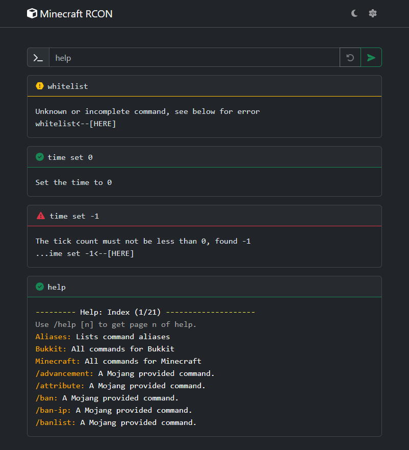

# Minecraft-RCON

A simple RCON console for Minecraft servers, with a REST API.



## Usage

### Warnings

* Provided as it is, **this console has no authentication check**, so anybody with access to this console can run any commands on the Minecraft server.

* Please **do not expose this console to the internet without any security measures**.

* Please consider setting up a reverse proxy with an authentification layer in front of this console, or any other security measures, in order to restrict the access.
  The following links can help you to find and setup a reverse proxy:
  * [Awesome list of reverse proxies](https://awesome-selfhosted.net/tags/web-servers.html)
  * [Awesome list of identity management](https://github.com/awesome-foss/awesome-sysadmin?tab=readme-ov-file#identity-management---single-sign-on-sso)

* Use a strong custom random RCON password for more security.

### Docker

Below is an example of a `docker-compose.yml` file to run the Minecraft server and the RCON console:

Please really read the [warnings above](#warnings) before running this example.

```yml
version: "3"

services:

  minecraft:
    image: itzg/minecraft-server:latest
    container_name: minecraft
    restart: unless-stopped
    environment:
      TYPE: PAPER
      VERSION: latest
      PAPER_CHANNEL: experimental
      EULA: "TRUE"
      ENABLE_RCON: true
      RCON_PASSWORD: ${RCON_PASSWORD}
    tty: true
    stdin_open: true
    volumes:
      - data:/data
    ports:
      - 25565:25575

  rcon:
    image: registry.kirauks.net/kirauks/minecraft-rcon:latest
    container_name: minecraft-rcon
    read_only: true
    restart: unless-stopped
    environment:
      RCON_HOST: minecraft
      RCON_PORT: 25575
      RCON_PASSWORD: ${RCON_PASSWORD}
    ports:
      - 8888:8888

volumes:
  data:
```

## Environment variables

The following environment variables can be set to configure the backend:
- `RCON_HOST`: The Minecraft server hostname or IP address. Set to `localhost` by default.
- `RCON_PORT`: The Minecraft server RCON port. Set to `25575` by default.
- `RCON_PASSWORD`: The Minecraft server RCON password. Set to `insecure_secret` by default, please change it to a strong random password.
- `ROCKET_ADDRESS`: The address to bind the Rocket server to. Set to `0.0.0.0` by default.
- `ROCKET_PORT`: The port to bind the Rocket server to. Set to `8888` by default.
- `ROCKET_IP_HEADER`: The maximum size of the request body in bytes. Set to `X-Forwarded-For` by default, to be updated depending on your reverse proxy configuration.

# Backend API

The backend is build using [Rust](https://www.rust-lang.org/) and the [Rocket](https://rocket.rs/) web framework.

## API Endpoints

By default, a Swagger UI is available at `/swagger-ui` to interact with the API.

- `POST /api/rcon`: The command is sent to the RCON server and the response is returned. The body of the request should be the command to send.
  
  In case of success, the response will be a JSON object with the key `payload` containing the response of the RCON server:
  ```json
  {
    "id": <The generated RCON request id>,
    "payload": <The command reply>
  }
  ```

  In case of error, multiple status codes can be returned:
  - **500 Internal Server Error**: Internal error.
  - **502 Bad Gateway**: Unable to connect to the RCON server. Please check the values of the `RCON_HOST`, `RCON_PORT` environment variables.
  - **503 Service Unavailable**: The RCON server did not respond as expected.
  - **511 Network Authentication Required**: The RCON server refused the connection. Please check the value of the `RCON_PASSWORD` environment variable.
- `GET /api-docs/openapi.json`: OpenAPI endpoint. Returns the [OpenAPI](https://swagger.io/specification/) specification of the API.
- `GET /metrics`: Prometheus metrics endpoint. Returns various metrics about the backend using the [OpenMetrics](https://openmetrics.io/) format.

## Build

You can build the backend with the following command:

```sh
cargo build
```

### Features

- `swagger`: Enable the openapi endpoint and the swagger UI (accessible at `/swagger-ui`). Enabled by default.
- `metrics`: Enable the prometheus metrics endpoint (accessible at `/metrics`) Enabled by default.

## Run for development

You can run the backend with the following command:

```sh
cargo run
```

## Execute the tests

You can run the tests with the following command:

```sh
cargo test
```

To be able to execute all the tests, you need to have setup the environement variables below on your
development environment:
- `RCON_HOST`: The Minecraft server hostname or IP address.
- `RCON_PORT`: The Minecraft server RCON port.
- `RCON_PASSWORD`: The Minecraft server RCON password.

# Frontend WebUI

The frontend is build using [TypeScript](https://www.typescriptlang.org/) and the [Angular](https://angular.io/) web framework.

## Build

You can build the frontend with the following command:

```sh
cd ui
npm ci
npm run build
```

To build the frontend, you may need a [FontAwesome Pro](https://fontawesome.com/plans) license to install the icons used in the UI.
If you don't have a FontAwesome Pro license, you can remove the icons from the UI and replace them with free icons:
- Update the `/ui/.npmrc` file to remove the `@fortawesome:registry` and `@awesome.me:registry` lines.
- Delete the `/ui/package-lock.json` file and the `/ui/node_modules` directory.
- Run the `npm install` command to install the packages from scratch and without the FontAwesome Pro registry.
- Replace any `fa-icon` raising an error with a free icon from [FontAwesome Free](https://fontawesome.com/v6/search?o=r&m=free).

## Run for development

You can run the frontend with the following command:

```sh
cd ui
npm ci
npm run start
```

## Execute the tests

You can run the tests with the following command:

```sh
cd ui
npm ci
npm run test
```

The tests are configured to run with both a headless Chrome browser and a Firefox browser by default.

To change the browser used for the tests, you can modify the `browsers` option in the `/ui/karma.conf.js` file.
Please refer to the [Karma documentation](https://karma-runner.github.io/6.4/config/configuration-file.html#browsers) for more information.
