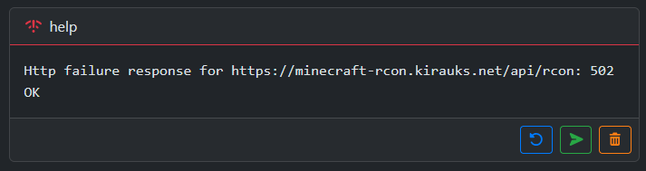

> This is a **mirror** of a private GitLab project.
>
> The code is open source and Docker images are available on [Docker Hub](https://hub.docker.com/r/rauks/minecraft-rcon).
> Issues and PRs are welcome as feedback; feel free to **fork** the project.
>
> More info: [CONTRIBUTING.md](./CONTRIBUTING.md).

# Minecraft-RCON

A simple RCON console for Minecraft servers, with a REST API.


## Usage

### Warnings

* Provided as it is, **this console has no authentication check**, so anybody with access to this console can run any commands on the Minecraft server.

* Please **do not expose this console to the internet without any security measures**.

* Please consider setting up a reverse proxy with an authentication layer in front of this console, or any other security measures, in order to restrict the access.
  The following links can help you to find and set up a reverse proxy:
  * [Awesome list of reverse proxies](https://awesome-selfhosted.net/tags/web-servers.html)
  * [Awesome list of identity management](https://github.com/awesome-foss/awesome-sysadmin?tab=readme-ov-file#identity-management---single-sign-on-sso)

* Use a strong custom random RCON password for more security.

### Docker

The docker image is available on [Docker Hub](https://hub.docker.com/r/rauks/minecraft-rcon) and can be used to run the console without having to build it from source.
Two series of tags are available:
- `master`: Unstable tag built from the `master` branch, with the latest features, dependencies updates and bug fixes, but may contain bugs and breaking changes.
- `x.z.y` versioned tags (e.g. `2.6.6`): Trying to be stable releases and immutable tags, following the [Semantic Versioning](https://semver.org/) format. Best if you want to use auto-updates bots like [Dependabot](https://dependabot.com/) or [Renovate](https://www.mend.io/renovate/) in a GitOps context.

Below is an example of a `docker-compose.yml` file to run the Minecraft server and the RCON console:

Please really read the [warnings above](#warnings) before running this example.

```yml
services:

  minecraft:
    image: docker.io/itzg/minecraft-server:latest
    container_name: minecraft
    restart: unless-stopped
    environment:
      TYPE: PAPER
      VERSION: latest
      PAPER_CHANNEL: experimental
      EULA: "TRUE"
      ENABLE_RCON: true
      RCON_PASSWORD: ${RCON_PASSWORD}
    tty: true
    stdin_open: true
    volumes:
      - data:/data
    ports:
      - 25565:25565

  rcon:
    image: docker.io/rauks/minecraft-rcon:master
    container_name: minecraft-rcon
    read_only: true
    restart: unless-stopped
    environment:
      RCON_HOST: minecraft
      RCON_PORT: 25575
      RCON_PASSWORD: ${RCON_PASSWORD}
    ports:
      - 8888:8888

volumes:
  data:
```

### Environment variables

The following environment variables can be set to configure the backend:
- `RCON_HOST`: The Minecraft server hostname or IP address. Set to `localhost` by default.
- `RCON_PORT`: The Minecraft server RCON port. Set to `25575` by default.
- `RCON_PASSWORD`: The Minecraft server RCON password. Set to `insecure_secret` by default, please change it to a strong random password.
- `RCON_TIMEOUT`: The timeout in milliseconds for the RCON replies waiting. Set to `5000` by default.
- `ROCKET_ADDRESS`: The address to bind the Rocket server to. Set to `0.0.0.0` by default.
- `ROCKET_PORT`: The port to bind the Rocket server to. Set to `8888` by default.
- `ROCKET_IP_HEADER`: The header to use to get the client IP address from the reverse proxy. Set to `X-Forwarded-For` by default, to be updated depending on your reverse proxy configuration.

### Common errors



If you encounter an `HTTP failure response` as shown above when trying to send a command, it means that the backend was not able to send the command to the Minecraft server and get a response.
The status code of the error can help you to identify the cause of the problem:
- `502`: The backend was unable to connect to the RCON server. Please check the values of the `RCON_HOST`, `RCON_PORT` environment variables and make sure that the RCON server is running and accessible from the backend.
- `503`: The minecraft server did not respond as expected. Please check the value of the `RCON_TIMEOUT` environment variable and make sure that the minecraft server is running, not overloaded and can respond to the RCON requests in a timely manner.
- `511`: The RCON server refused the connection. Please check the value of the `RCON_PASSWORD` environment variable and make sure that it matches the RCON password configured on the Minecraft server.

# Backend API

The backend is built using [Rust](https://www.rust-lang.org/) and the [Rocket](https://rocket.rs/) web framework.

## API Endpoints

By default, a Swagger UI is available at `/swagger-ui` to interact with the API.

- `POST /api/rcon`: The command is sent to the RCON server and the response is returned. The body of the request should be the command to send.
  
  In case of success, the response will be a JSON object with the key `payload` containing the response of the RCON server:
  ```json
  {
    "id": <The generated RCON request id>,
    "payload": <The command reply>
  }
  ```

  In case of error, multiple status codes can be returned:
  - **500 Internal Server Error**: Internal error.
  - **502 Bad Gateway**: Unable to connect to the RCON server. Please check the values of the `RCON_HOST`, `RCON_PORT` environment variables.
  - **503 Service Unavailable**: The RCON server did not respond as expected.
  - **511 Network Authentication Required**: The RCON server refused the connection. Please check the value of the `RCON_PASSWORD` environment variable.

- `GET /api-docs/openapi.json`: OpenAPI endpoint. Returns the [OpenAPI](https://swagger.io/specification/) specification of the API.

- `GET /metrics`: Prometheus metrics endpoint. Returns various metrics about the backend using the [OpenMetrics](https://openmetrics.io/) format. More information about the metrics can be found in the [Rocket Prometheus documentation](https://github.com/sd2k/rocket_prometheus).

## Build

You can build the backend with the following command:

```sh
cargo build
```

### Features

- `swagger`: Enable the OpenAPI endpoint and the Swagger UI (accessible at `/swagger-ui`). Enabled by default.
- `metrics`: Enable the Prometheus metrics endpoint (accessible at `/metrics`). Enabled by default.

## Run for development

You can run the backend with the following command:

```sh
cargo run
```

## Execute the tests

You can run the tests with the following command:

```sh
cargo test
```

To be able to execute all the tests, you need to have set up the environment variables below on your
development environment:
- `RCON_HOST`: The Minecraft server hostname or IP address.
- `RCON_PORT`: The Minecraft server RCON port.
- `RCON_PASSWORD`: The Minecraft server RCON password.

# Frontend WebUI

The frontend is built using [TypeScript](https://www.typescriptlang.org/) and the [Angular](https://angular.io/) web framework.

## Build

You can build the frontend with the following command:

```sh
cd ui
npm ci
npm run build
```

To build the frontend, you may need a [FontAwesome Pro](https://fontawesome.com/plans) license to install the icons used in the UI.
If you don't have a FontAwesome Pro license, you can remove the icons from the UI and replace them with free icons:
- Update the `/ui/.npmrc` file to remove the `@fortawesome:registry` and `@awesome.me:registry` lines.
- Delete the `/ui/package-lock.json` file and the `/ui/node_modules` directory.
- Replace the `@fortawesome/pro-solid-svg-icons` and `@fortawesome/pro-regular-svg-icons` packages by `@fortawesome/free-solid-svg-icons` and `@fortawesome/free-regular-svg-icons` in the `/ui/package.json` file.
- Run the `npm install` command to install the packages from scratch.
- Replace any `fa-icon` components using Pro icons with free icons from [FontAwesome Free](https://fontawesome.com/v6/search?o=r&m=free).

## Run for development

You can run the frontend with the following command:

```sh
cd ui
npm ci
npm run start
```

## Execute the tests

The frontend uses [Vitest](https://vitest.dev/) as the test runner and [Playwright](https://playwright.dev/) for browser automation.
To initialize or update your testing environment, run:

```sh
cd ui
npm ci
npx playwright install --with-deps
```

This installs all dependencies and downloads the necessary browser binaries.
You can then run the tests with the following command:

```sh
cd ui
npm ci
npm run test
```
